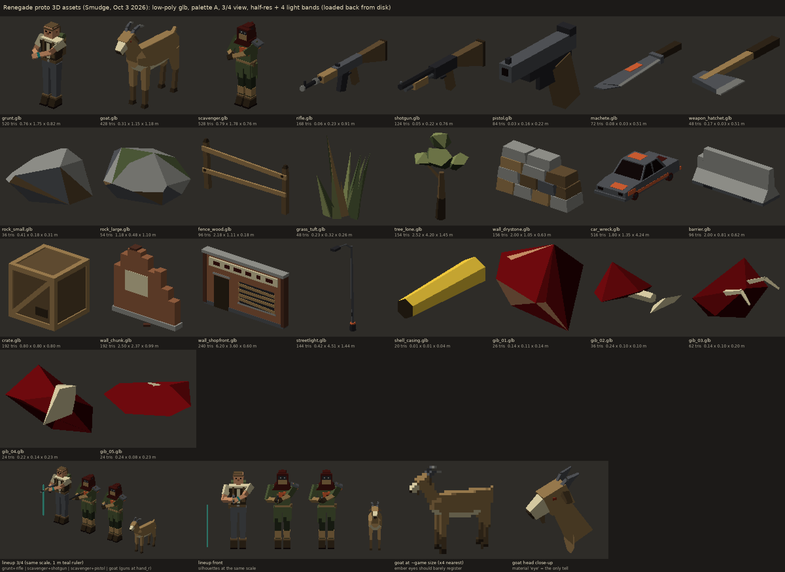

# Proto 3D assets (Smudge, Oct 3 2026)

Low-poly glTF binary models for the two isolated battle3d prototypes, `battle3d_goats` (Greyback Hills, grunts vs goats)
and `battle3d_urban` (Hollis Outskirts, troops vs scavengers).

They're built to **`/workspace/autobattler-design/proto-3d-asset-contract.md`**. I re-read its revision of Oct 3,
13:24 PT before committing. That covers the flat file names, the node names, the pivots, the two-handed rifle pose, the
`tint` / `eye` slots and the tri budgets. The names are also exactly what `proto/battle3d_goats/main.js` and
`proto/battle3d_urban/main.js` request today.

- **Format:** `.glb`, glTF 2.0, no compression, no textures, no cameras, lights or animations. Metres, **Y up, +Z
  forward**, no root transform, and **every node has identity rotation and scale** (translations only; poses are baked).
- **Colour:** flat, one solid colour per face, every colour from **palette A** (`assets/style-test/src/palettes.py`).
  Units, weapons and props use one primitive per material, with the materials named by role and `baseColorFactor` only.
  The factor is stored linear, so `material.color.getHex()` returns the palette hex, and `material.userData.hex` has it too.
  The four files the pages read as a single mesh (`grass_tuft`, `shell_casing`, `gib_01..05`) are **one primitive with
  per-face vertex colours** (`COLOR_0`) and a white `vertex_colour` material.
- **manifest.json** lists all 26 files.
- **Rebuild:** `python3 src/build_assets3d.py` (numpy + scipy) writes every `.glb`, `manifest.json` and `src/build_stats.json`.
  `python3 src/check_assets3d.py` (+ trimesh, pygltflib, pillow) loads every file back from disk and checks the budgets,
  required nodes, root and node transforms, base at y = 0, centring, +Z facing (face features in front of the head
  pivot, muzzle at +Z and stock at -Z), `tint` / `eye`, and a single primitive where needed. It writes
  `src/check_report.json` and renders `preview_assets3d.png` with a small z-buffer rasteriser: back-faces are culled,
  so a flipped face shows as a hole, and it uses 4 light bands at half resolution.
- **Tested in three.js:** every file also loads in the vendored three r185 `GLTFLoader`. Through a scratch copy of
  `shared/3d/figures.js`, `makeHuman` / `makeGoat` / `makeWeapon` take the GLB path with no missing-node notes, and a
  goat ragdoll with a head detach runs.

## Files (4088 tris for one of each)

| file | tris / budget | size x * y * z (m) | KB | what |
|---|---|---|---|---|
| `grunt.glb` | 520 / 1200 | 0.76 x 1.75 x 0.82 | 53.4 | mannequin-based survivor: light shirt, dark vest (`tint`), grey pants, boots, brown hair, teal wristband (left), backpack + bedroll (`pack` under `torso`). Two-handed rifle hold |
| `goat.glb` | 428 / 1200 | 0.31 x 1.15 x 1.18 | 42.7 | a totally normal domestic goat: tan coat, light belly and muzzle, darker lower legs and beard, grey horns, short upright tail. Only tell: two tiny dim-ember eye faces (`eye`) |
| `scavenger.glb` | 528 / 1200 | 0.79 x 1.78 x 0.76 | 55.1 | hooded raider: dark-rust hood + mantle, rag mask, olive coat (`tint`), ragged coat flaps (on the legs), steel pauldron, rust scrap chest plate, shin wraps. Same skeleton and hold as the grunt |
| `rifle.glb` | 168 / 250 | 0.06 x 0.23 x 0.91 | 16.0 | pipe rifle: wood stock + rubber butt plate (-Z), steel receiver, pipe barrel with a coupling and muzzle ring (+Z), mag, sights |
| `shotgun.glb` | 124 / 250 | 0.05 x 0.22 x 0.76 | 12.3 | pump shotgun: wood stock, dark receiver, barrel over a mag tube, wood pump, bead sight |
| `pistol.glb` | 84 / 250 | 0.03 x 0.16 x 0.22 | 8.9 | pistol: steel slide, dark frame, wood grip, dark muzzle bore at +Z |
| `machete.glb` | 72 / 250 | 0.08 x 0.03 x 0.51 | 8.0 | machete: wrapped grip, guard, blade along +Z with its edge facing +X, clipped tip, rust spot |
| `weapon_hatchet.glb` | 48 / 250 | 0.17 x 0.03 x 0.51 | 6.3 | hatchet: wrapped wood handle along +Z, steel head at the +Z end, bright edge facing +X |
| `rock_small.glb` | 36 / 300 | 0.41 x 0.18 x 0.31 | 4.7 | small rock (light-grey tops, grey / brown sides) |
| `rock_large.glb` | 54 / 300 | 1.18 x 0.48 x 1.10 | 6.6 | large flat rock with moss on top |
| `fence_wood.glb` | 96 / 300 | 2.18 x 1.11 x 0.18 | 9.0 | 2 rustic posts at x = +-1, 2 sagging rails on the +Z face |
| `grass_tuft.glb` | 48 / 60 | 0.23 x 0.32 x 0.26 | 6.3 | 12 closed blade spikes (2 greens + 2 dry blades), one primitive with vertex colours |
| `tree_lone.glb` | 154 / 1500 | 2.52 x 4.20 x 1.45 | 14.3 | chunky lone tree: 3-part trunk, 4 olive canopy clumps |
| `wall_drystone.glb` | 156 / 1500 | 2.00 x 1.05 x 0.63 | 13.8 | broken dry-stone wall, 4 courses (top stone tumbled at +X), nearly planar front and back, some moss |
| `car_wreck.glb` | 516 / 1500 | 1.80 x 1.35 x 4.24 | 41.0 | burnt-out sedan, front = +Z: soot-grey body, rust blotches, empty black windows, sitting on bare rims (one corner lower) |
| `barrier.glb` | 96 / 1500 | 2.00 x 0.81 x 0.62 | 9.5 | jersey barrier, real profile (0.61 m base, 0.15 m top, 0.81 m high), lifting slots, chipped +X end with rebar |
| `crate.glb` | 192 / 300 | 0.80 x 0.80 x 0.80 | 15.7 | framed wooden crate with diagonal braces and a stencil block |
| `wall_chunk.glb` | 192 / 1500 | 2.50 x 2.37 x 0.99 | 16.3 | broken brick wall, stepped top, flat front and back, plaster patches, concrete footing, loose bricks |
| `wall_shopfront.glb` | 240 / 1500 | 6.20 x 3.60 x 0.60 | 22.7 | 6 m shopfront, front = +Z: brick, pilasters, door, boarded window, faded sign with lettering blocks, cornice, plinth |
| `streetlight.glb` | 144 / 1500 | 0.42 x 4.51 x 1.44 | 13.0 | leaning streetlight, about 4.5 m, arm and lamp over +Z |
| `shell_casing.glb` | 20 / 24 | 0.01 x 0.01 x 0.04 | 3.4 | brass casing, 9 x 35 mm along Z, one primitive with vertex colours (brass / rim / mouth) |
| `gib_01.glb` | 26 / 80 | 0.14 x 0.11 x 0.14 | 4.0 | meat lump |
| `gib_02.glb` | 36 / 80 | 0.24 x 0.10 x 0.10 | 5.0 | bone with a meat collar |
| `gib_03.glb` | 62 / 80 | 0.14 x 0.10 x 0.20 | 7.8 | rib chunk |
| `gib_04.glb` | 24 / 80 | 0.22 x 0.14 x 0.23 | 3.8 | knuckle (a bone ball in meat) |
| `gib_05.glb` | 24 / 80 | 0.24 x 0.08 x 0.23 | 3.8 | flat flap with a bone splinter |

## Characters: nodes and pivots

All three are segmented "action figures": no skin and no bones. **Every required part is a direct child of the root**,
and each node's origin is its joint. A part with several colours loads as a `Group` of `Mesh`es, one per material.
The extra child nodes (lower limbs, pack, pauldron, coat flaps, neck) ride along on their part.

**`grunt.glb` / `scavenger.glb`**: feet at y = 0, 1.75 m tall (the hood reaches 1.78 m). The character's left is +X.
They stand in the **two-handed rifle hold** the contract asks for. The arms are baked forward, with the right hand on
the grip and the left hand under the receiver.

| node | origin (m) | notes |
|---|---|---|
| `torso` | (0, +0.90, 0) hip line | pelvis, belt, chest, vest or coat (grunt: child `pack` with the backpack + bedroll) |
| `head` | (0, +1.46, 0) neck | neck, head, hair / hood, face |
| `arm_l` | (+0.25, +1.40, 0) shoulder | upper arm, reaching forward and in (scav: child `pauldron_l`) |
| `arm_l_lower` | (+0.13, +1.26, +0.24) elbow | optional forearm + hand child |
| `arm_r` | (-0.25, +1.40, 0) shoulder | upper arm, forward and down |
| `arm_r_lower` | (-0.34, +1.14, +0.12) elbow | optional forearm + hand child |
| `hand_r` (empty) | (-0.11, +1.19, +0.34) | **the gun grip.** Put a weapon's origin here with no rotation and its barrel points +Z. The left hand sits 0.14 m ahead of it, under the receiver |
| `leg_l` / `leg_r` | (+-0.10, 0.90, 0) hip | thigh (scav: child `coat_flap_l/_r`, so the coat skirt swings with the leg and the torso box stays compact) |
| `leg_l_lower` / `leg_r_lower` | (+-0.10, 0.48, 0) knee | optional shin + boot child |

**`tint`** is the grunt's **vest** (painted #2e2418, the brief's dark vest) and the scavenger's **coat** (painted
#4a5636 olive), so the four scavengers are told apart by it. The grunt's eyes use the material `pupil`, never `eye`.

**`goat.glb`** stands about 0.80 m at the shoulder and 1.18 m from nose to tail, with its feet at y = 0.

| node | origin (m) | notes |
|---|---|---|
| `body` | (0, +0.61, 0) body centre | barrel body, light belly faces |
| `head` | (0, +0.72, +0.36) neck base, where the neck meets the body | head, muzzle, horns, ears, beard, eyes. The `neck` mesh is a child of `head` and rides on it |
| `leg_fl` / `leg_fr` | (+-0.095, 0.52, 0.26) top of the leg | front legs |
| `leg_bl` / `leg_br` | (+-0.095, 0.56, -0.30) top of the leg | hind legs, with a slight hock angle |
| `tail` | (0, +0.73, -0.42) tail root | short and upright |

The **`eye`** material is two 8 x 18 x 24 mm faces in #862c1c, a dim ember. It's barely visible close up and gone at
game scale (see the preview's bottom row). The goat has no scars, stripes or glow.

## Weapons

The origin of every weapon is the **grip**.
- **Guns** (`rifle`, `shotgun`, `pistol`): barrel **+Z**, stock **-Z**. Each has a `muzzle` empty at the barrel tip and
  an `eject` empty at the port on the gun's right side (-X).
  - rifle 0.91 m: `muzzle` (0, 0.075, 0.555), `eject` (-0.03, 0.085, 0.08)
  - shotgun 0.76 m: `muzzle` (0, 0.08, 0.44)
  - pistol 0.22 m: `muzzle` (0, 0.05, 0.163)
- **Melee** (`machete`, `weapon_hatchet`, each about 0.51 m): handle and blade run along **+Z** from the grip, and the
  cutting edge faces **+X**. That matches `makeWeapon`, which turns melee by `rotation.x = PI/2`, so +Z points down the
  arm and the edge leads the chop. Each has a `tip` empty.

## Notes for Rivet

1. **The `hand_r` lookup misses** (`shared/3d/figures.js` `fromGlb`). It runs `src.getObjectByName("hand_r")` *after*
   the parts have been re-parented to `root`, but `hand_r` lives under `arm_r` > `arm_r_lower`, so it's no longer in
   `src`, and every GLB human falls back to `GRIP`. Looking it up before the flatten loop, or on `root`, finds it.
   For reference, in your figure space (+x forward, +z right) it sits at about (0.34, 1.19, 0.11), against `GRIP`
   (0.20, 1.22, 0.14).
2. **Arm pose is applied twice.** The arms are baked in the contract's two-handed hold, but `setHeld` / `animate`
   still apply `armPose` (1.05 / 1.25 rad forward) to the GLB arm pivots. On top of the baked pose, that swings the
   arms up to about 2 m. For GLB figures the rest rotation should be 0, and only the chop / draw delta should be added.
3. **Facing:** the files face +Z. Your `fromGlb` already turns them with `rotation.y = PI/2`.
4. **Collision boxes,** from `Box3.setFromObject` on each part, in m. Grunt: torso 0.44 x 0.69 x 0.39 (includes the
   pack), head 0.26 x 0.28 x 0.28, legs 0.17 x 0.95 x 0.28. The forward arms give arm_l about 0.51 x 0.36 x 0.65 and
   arm_r about 0.37 x 0.42 x 0.52. Goat: body 0.31 x 0.34 x 0.84, head 0.29 x 0.50 x 0.44 (neck + horns), legs
   0.09-0.10 x 0.56-0.61 x 0.11-0.16, tail 0.06 x 0.11 x 0.10.
5. **Shell casing:** `shell_casing.glb` is the contract's 9 x 35 mm, but `fx.js` still uses a 35 x 35 x 90 mm physics
   box (`addBox(0.0175, 0.0175, 0.045)`). The casing will float over its box unless you shrink the box, or scale the
   instance by about 2.5 to 3 (bigger reads better at half res anyway).
6. **Grass tufts:** `grass_tuft.glb` is painted in palette greens, and `setColorAt` multiplies the instance colours on
   top. With the current HSL tints (L 0.34-0.46) the grass comes out quite dark. Near-white instance colours, or none,
   keep the painted greens.
7. **Prop origins:** props are bbox-centred in X/Z with the base at y = 0, except `fence_wood`. Its X is kept so the
   posts stay at x = +-1, and only Z is centred. For `streetlight`, bbox-centring puts the pole base at about z = -0.57,
   because the lamp arm overhangs +Z. Gibs and the casing are centred on their bbox centre.
8. **Red:** the only saturated reds are on the gibs (dark blood ramp). The rust on units and props is the palette's
   orange-brown #c65a30 or the near-black #3e1410.

`src/` also holds a few builders that aren't built any more: the dumpster, barrel, sandbags, `wall_ruin`, debris pile,
dead tree, fence post, the scav-gunman variant and the scav carbine. They came from the contract's first draft
(13:05 PT), and its 13:24 revision dropped them.
